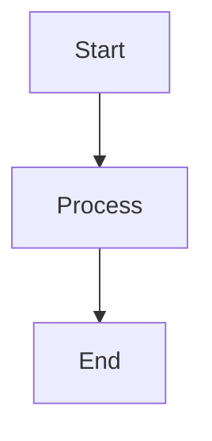

For a live demo of Bloggrify in action, check out [our demo blog](https://mistral.bloggrify.com).

## Standard Markdown Support

Bloggrify supports all standard Markdown formatting you would expect:

* **Text formatting**: bold, italic, strikethrough
* **Headings**: from H1 to H6
* **Lists**: ordered and unordered
* **Links**: internal and external
* **Images**: with alt text and captions
* **Code blocks**: with syntax highlighting and copy button
* **Blockquotes**: for quotes and callouts
* **Footnotes**: for citations and references
* **Tables**: for data and comparisons

## Enhanced Markdown Features

Beyond basic Markdown, Bloggrify supports several advanced features:

### Mathematics

Bloggrify supports mathematical expressions using KaTeX:

```markdown
$E = mc^2$

$$
\frac{n!}{k!(n-k)!} = \binom{n}{k}
$$
```

[Show demo](https://minimalist.bloggrify.com/2024/katex).

### Diagrams with Mermaid

Create flowcharts, sequence diagrams, class diagrams and more:

````markdown

````

[Show demo](https://minimalist.bloggrify.com/2024/mermaid).
